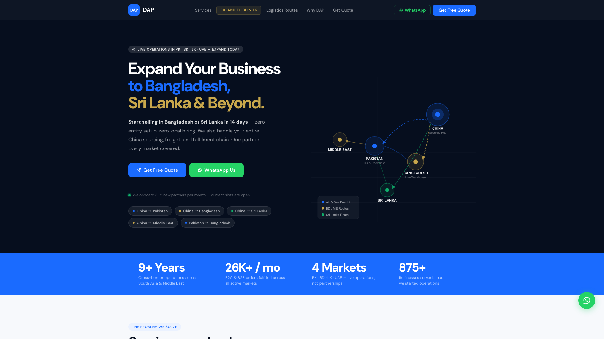
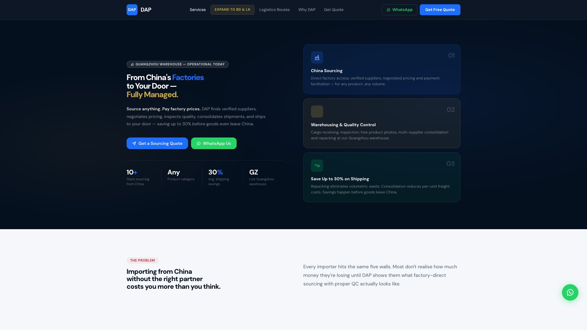
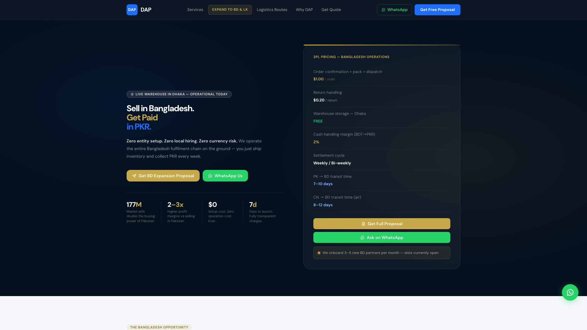
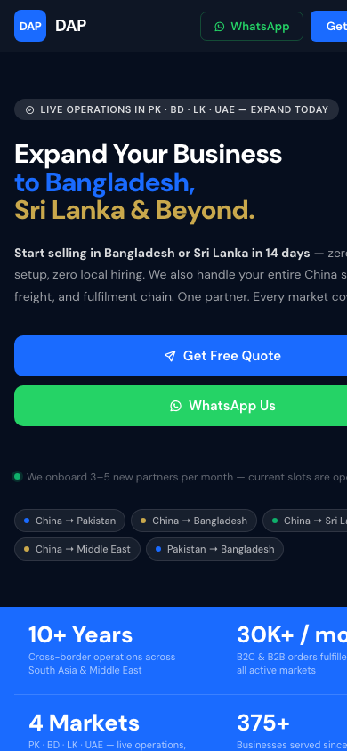
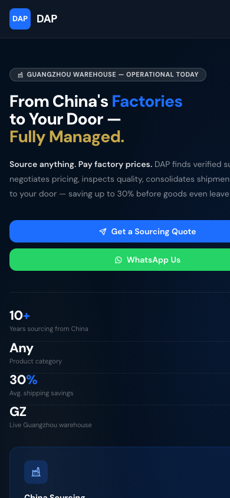

<p align="center">
  
</p>

<h1 align="center">Bespoke WordPress Themes</h1>

<p align="center">
  <strong>Pixel-perfect custom WordPress development for enterprise &amp; growth-stage brands</strong><br>
  95+ PageSpeed · One plugin (ACF) · HubSpot-ready · SEO-native · Fully bespoke
</p>

<p align="center">
  <a href="https://www.linkedin.com/in/muhammad-hamid-dev/">LinkedIn</a> ·
  <a href="https://github.com/muhammad-hamid-jamil">GitHub</a> ·
  <a href="https://websolsolutions.com/">Websol Solutions</a>
</p>

<p align="center">
  
  
  
  
  
</p>

---

## What this repository is

This is a **public showcase** of my bespoke WordPress theme work — architecture patterns, integration approach, and UI quality. It is **not** a downloadable client theme.

| Included publicly | Available on engagement |
|-------------------|-------------------------|
| Case study overview | Full custom theme source |
| Architecture docs | 400+ ACF field wiring |
| Sanitized code samples | HubSpot / CRM configuration |
| Frontend screenshots | Admin documentation & handover |
| Performance approach | Client-specific SEO & content |

> Client deliverables remain private. This repo exists to demonstrate capability for **new bespoke projects**.

---

## Featured case study — Enterprise logistics platform

**Industry:** Cross-border e-commerce & logistics (PK · BD · LK · UAE)  
**Scope:** 6 marketing pages · CRM lead capture · Legal · SEO  
**Built by:** [Muhammad Hamid](https://www.linkedin.com/in/muhammad-hamid-dev/)

### Pages delivered

| Page | Highlights |
|------|------------|
| **Home** | Hero, services grid, routes map, lead form, testimonials |
| **China Sourcing** | Video USP, warehouse/QC sections, 7-field enquiry form |
| **Bangladesh Expansion** | Market opportunity, fulfilment flow, BD proposal form |
| **About** | Timeline, operations map, values |
| **Privacy & Terms** | Editable legal content, dynamic contact injection |

### Results

- **Pixel-perfect** conversion from client HTML designs — zero layout drift
- **95+ mobile PageSpeed** with only **Advanced Custom Fields** as the content plugin
- **No page builders** — no Elementor, no Divi, no bloat
- **HubSpot Forms API** — custom UI forms, server-side submit, contact linking
- **~400 editable fields** — safe text/image/video admin without breaking design
- **Native SEO** — meta, Open Graph, Twitter Cards, Schema.org JSON-LD

---

## Frontend showcase

<details open>
<summary><strong>Home — Desktop</strong></summary>
<br>

</details>

<details>
<summary><strong>China Sourcing — Desktop</strong></summary>
<br>

</details>

<details>
<summary><strong>Bangladesh Expansion — Desktop</strong></summary>
<br>

</details>

<details>
<summary><strong>Mobile responsive</strong></summary>
<br>
<p align="center">
  
  &nbsp;
  
</p>
</details>

---

## How I build bespoke themes

```
Client HTML design
       │
       ▼
┌──────────────────────────────────────┐
│  WordPress theme (custom, no builder) │
│  ├── template-parts/  ← layout locked │
│  ├── assets/css|js    ← per-page      │
│  ├── ACF fields       ← safe editing  │
│  ├── HubSpot API      ← CRM leads     │
│  └── SEO module       ← native tags   │
└──────────────────────────────────────┘
       │
       ▼
  Admin edits copy · images · video
  Frontend stays pixel-perfect
```

### Safe content editing (why layouts never break)

```php
// Layout in PHP partial — never replaced by admin HTML
<h2><?php demo_text( 'hero_heading', 'Get your rate card in 48 hours' ); ?></h2>
```

Empty ACF field → original design text shows. Filled field → new copy only. **Structure unchanged.**

See: [`showcase/safe-content-pattern.php`](showcase/safe-content-pattern.php)

### HubSpot without embed scripts

Custom-designed forms submit through a **WordPress AJAX proxy** → HubSpot Forms API v3 (IP address + tracking cookie included).

See: [`showcase/hubspot-form-submit.php`](showcase/hubspot-form-submit.php)

Full architecture: [`docs/architecture-overview.md`](docs/architecture-overview.md)

---

## Performance philosophy

| Approach | Why |
|----------|-----|
| One CSS file per template | No unused CSS on other pages |
| One JS bundle per template | Minimal parse/execute cost |
| No page builder | Eliminates 200KB+ of builder assets |
| ACF only | Single plugin for all admin editing |
| System fonts + CDN icons | Fast first paint |
| Server-side form proxy | No third-party form iframe |

**Target:** 95+ mobile PageSpeed on marketing pages with real content and forms.

---

## Tech stack

**Frontend:** HTML5 · CSS3 · Vanilla JS · DM Sans · Tabler Icons  
**CMS:** WordPress · Advanced Custom Fields  
**CRM:** HubSpot Forms API · Tracking script  
**SEO:** Native theme module (Yoast/Rank Math compatible)  
**Integrations:** REST API · WhatsApp deep links · Dynamic legal content

---

## Services — available for new projects

- Bespoke WordPress themes from Figma / HTML / PDF designs
- Pixel-perfect responsive builds (desktop · tablet · mobile)
- ACF-native admin panels (no builder lock-in)
- HubSpot / Salesforce / custom CRM form integration
- WooCommerce & headless-adjacent setups
- Performance audits & 90+ PageSpeed optimization
- Legal pages, SEO, Schema.org, multi-language ready architecture

---

## About the developer

**Muhammad Hamid** — Full Stack / WordPress Developer  
Lahore, Pakistan · Frontend / Full Stack @ [Websol Solutions](https://websolsolutions.com/)

- [LinkedIn](https://www.linkedin.com/in/muhammad-hamid-dev/)
- [GitHub](https://github.com/muhammad-hamid-jamil)
- Email: `muhammadhamidjamil0@gmail.com`

Other pinned work: [Aldar Real Estate WP REST API](https://github.com/muhammad-hamid-jamil/Aldar-Real-Estate-WordPress-REST-API) · [Shopify migrations](https://github.com/muhammad-hamid-jamil/stegbar-shopify-migration) · [WooCommerce payment gateway](https://github.com/muhammad-hamid-jamil/Autify-Digital-Taylr-Payment-Gateway-WooCommerce-)

---

## Request a bespoke build

Looking for a **custom WordPress theme** — pixel-perfect, fast, CRM-connected, admin-friendly?

1. Share your design (Figma / HTML / live reference)
2. I'll scope pages, integrations, and timeline
3. Delivery includes theme, ACF setup, documentation, and handover

**[Connect on LinkedIn →](https://www.linkedin.com/in/muhammad-hamid-dev/)**

---

## License & usage

- **Showcase code** in `/showcase` — reference only, MIT-style use with attribution
- **Full client themes** — proprietary, not published in this repository
- **Screenshots** — from a completed client project, used with permission for portfolio display

---

<p align="center">
  <sub>Built with precision by <a href="https://github.com/muhammad-hamid-jamil">Muhammad Hamid</a> · Bespoke WordPress Theme Development</sub>
</p>
